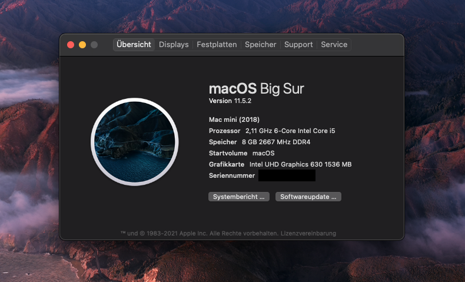
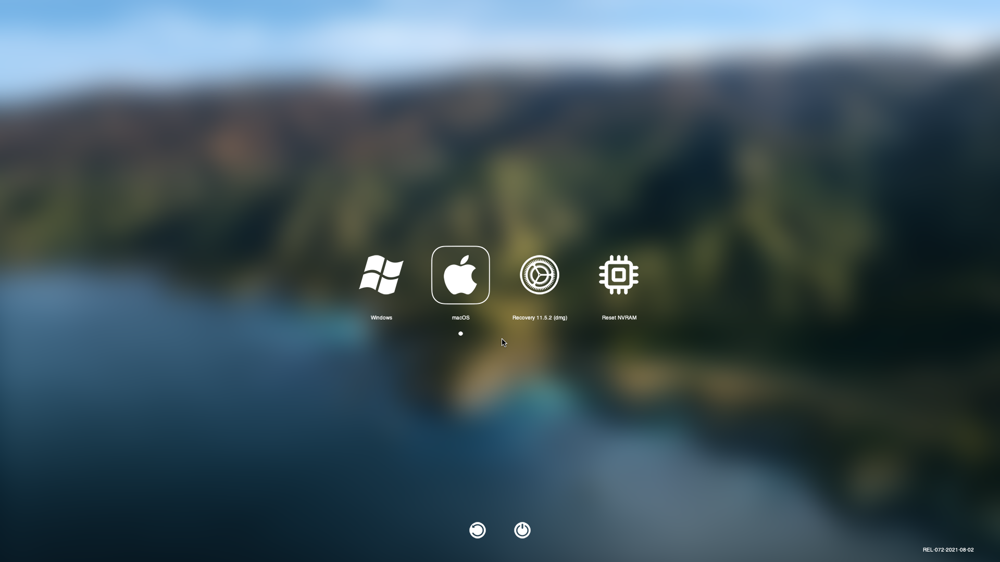

## HP EliteDesk 800 G4 Mini OpenCore EFI

This repository contains a generic [OpenCore](https://github.com/acidanthera/OpenCorePkg) based **EFI folder** for booting macOS on **HP EliteDesk 800 G4 Mini** computers.

This EFI is based off the excellent work of [deeveedee](https://www.tonymacx86.com/members/deeveedee.217925/) over at [tonymacx86](https://www.tonymacx86.com/threads/big-sur-on-hp-elitedesk-800-g4-g5-mini-the-perfect-macmini8-1-hackintosh-opencore.306132).

For more information on how to install macOS on a **HP EliteDesk 800 G4 Mini** please consult the linked thread above.

For convenience sake this repository includes the recommended UEFI configuration and additional *DeviceProperties* configurations in the [EXTRAS folder](EXTRAS).

Features of this EFI:

* working macOS boot
* working BootCamp
* graphical boot picker via OpenCanopy with [BigSurFlat theme](https://github.com/82ghost82/BigSurFlat)

* 15 port limit of BigSur is complied with by disabling the internal ports for the WiFi/BT module
* Disabled boot chime

### Images

